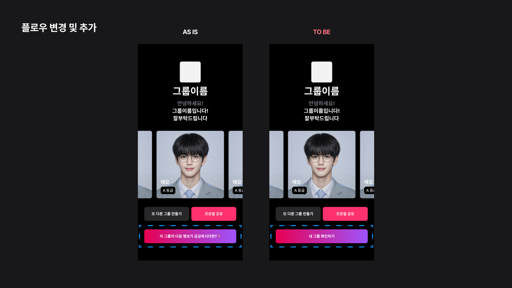
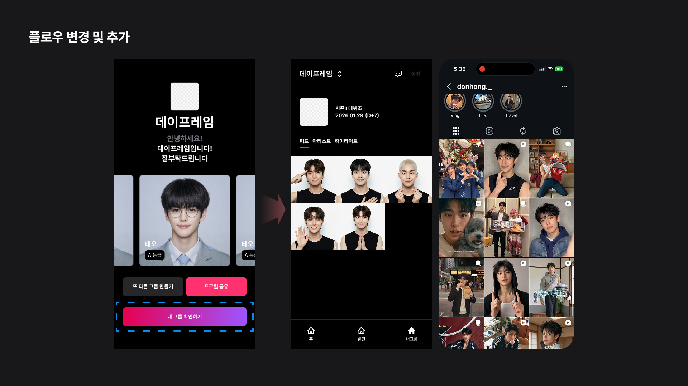
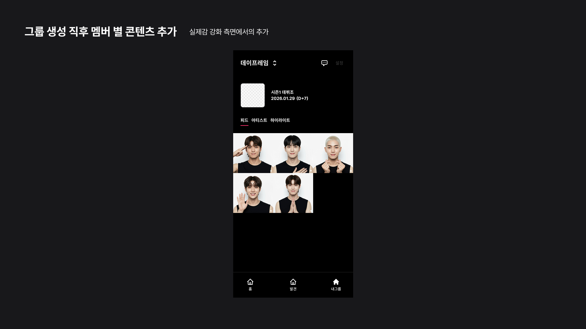
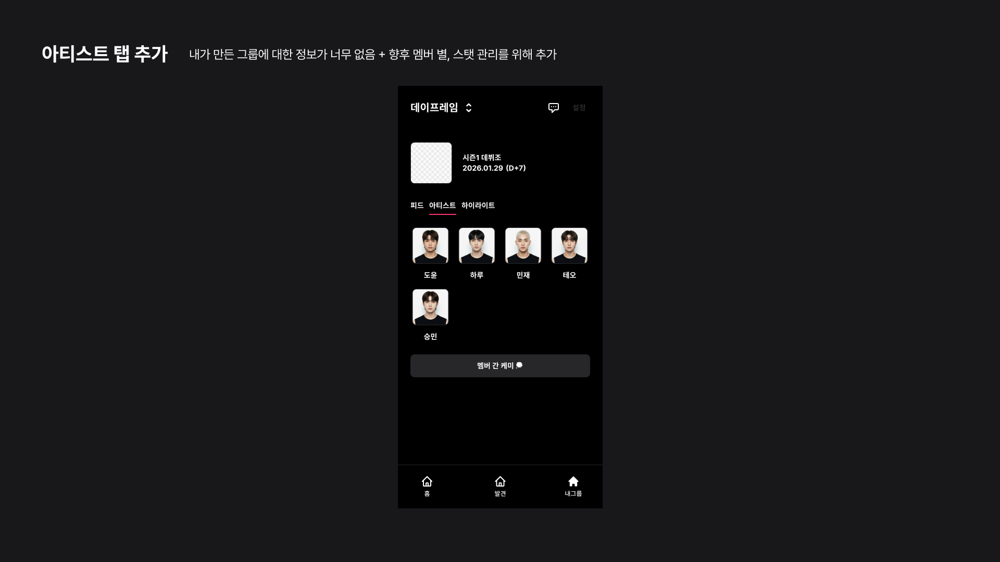
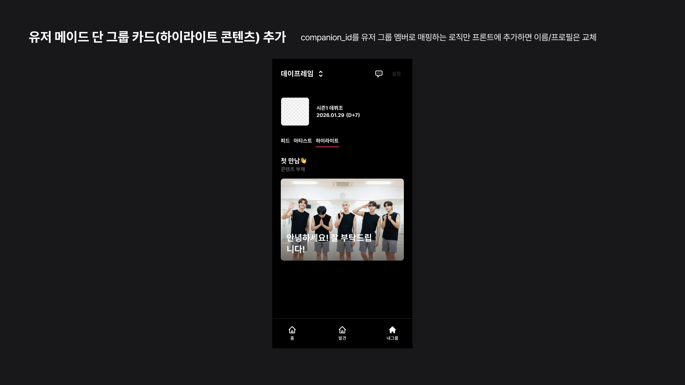
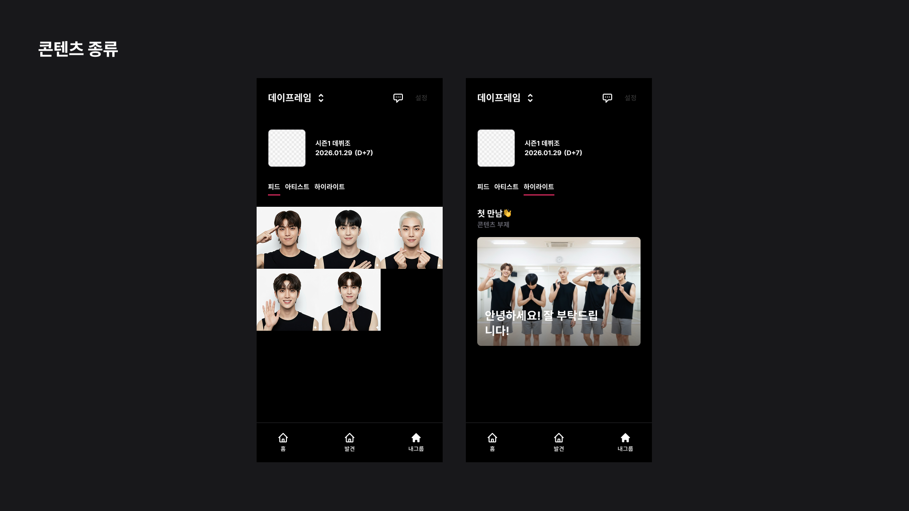
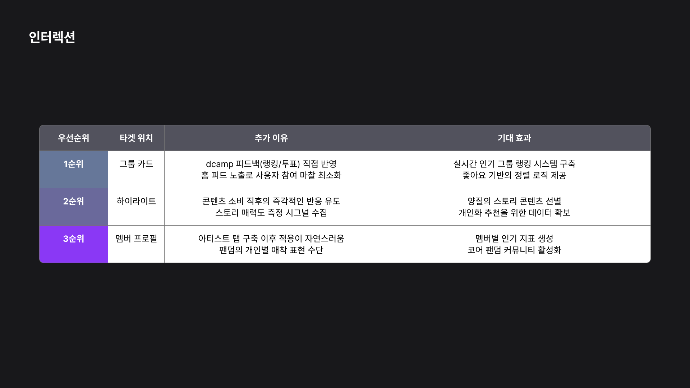
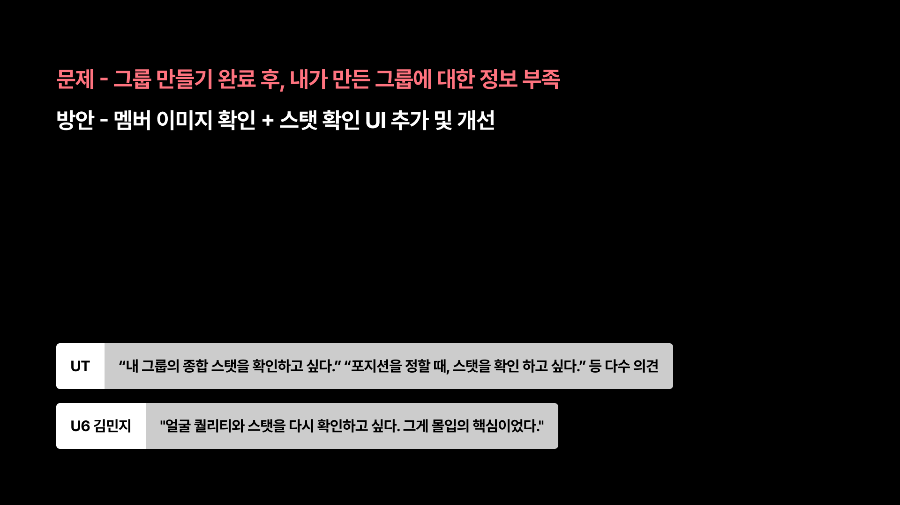
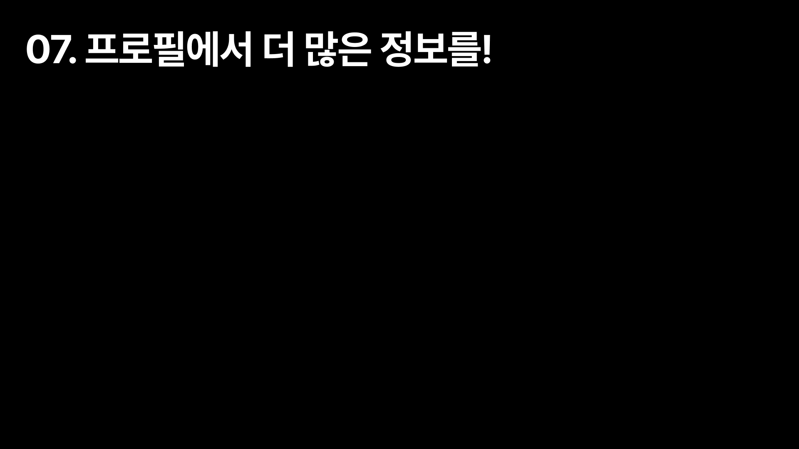

# Phase 2 기획 발표

**마스터 문서** (상세 버전은 `phase2-presentation/*.md` 참고)

- **발표자**: 전제이 (UX/UI 디자인)
- **발표일**: 2026-02-25
- **버전**: v2.0 (통합본, 이미지 캡션 포함)
- **생성일**: 2026-02-26

---

## 목차

1. [도입 & 3주 계획](#1-도입--3주-계획)
2. [문제 정의 & 방향성](#2-문제-정의--방향성)
3. [실제감 강화 기능](#3-실제감-강화-기능)
4. [AI 아이돌 가이드 개선](#4-ai-아이돌-가이드-개선)
5. [확장 영역 (향후 검토)](#5-확장-영역-향후-검토)
6. [개발팀 기술 검증](#6-개발팀-기술-검증)

---

## 1. 도입 & 3주 계획

**발표자**: 전제이
**슬라이드**: Phase2-00 (표지), Phase2-01 (계획)

네 일단 페이지 2 방향성에 대해 좀 논의를 해봤고요. 어제 주차별로 나온 계획은 다음과 같습니다. 근데 아직 좀 큰 틀에서만 나왔고 롤별로 구체적인 계획은 안 나온 상태인 것 같아요.

그래서 일단 로그인 계정 부분에 대해서는 이거는 일단 패스를 하겠습니다. 제가 좀 이거는 고민을 한 흔적이고요. 이제 페이즈 2의 큰 방향은 실제감 강화가 될 것 같아요.

### 3주 스프린트 계획

**3주 스프린트 계획**: W1(PO 버그&기초), W2(로그인&세션), W3(실제감&탐색), W4+(백로그)

슬라이드의 주차별 계획 표를 보시면:

- **W1**: PO 버그 & 기초
- **W2**: 로그인 & 세션
- **W3**: 실제감 & 탈색
- **W4+**: 백로그

근데 아직 좀 큰 틀에서만 나왔고 롤별로 구체적인 계획은 안 나온 상태인 것 같습니다.

---

## 2. 문제 정의 & 방향성

**발표자**: 전제이
**슬라이드**: Phase2-02 (인증 방식 비교), Phase2-03 (문제 정의)

### 인증 방식 비교

**매직링크 vs 로그인**: 인증 방식 비교 (매직링크 vs 로그인)

### 실제감이 뭐냐면

디캠프 멘토님께서 저희 서비스를 사용해 보시고 단순 인형 놀이처럼 느껴질 수도 있다고 이제 코멘트를 주셨다고 합니다.

단순 인형놀이라는 것이 이 아이돌을 캐스팅하고 그냥 이미지로만 소비하거나 뭔가 이게 살아 있는 게 아니라 그냥 그냥 놀이 콘텐츠 가벼운 느낌의 그런 것 그런 느낌을 받으신 것 같아요.

그리고 ut에서도 좀 비슷한 의견이 나왔었어요. 그룹에서 다음 뭐 해야 될지 모르겠다.

### 팀 내 논의 결과

그다음에 뭐 저 이 팀 미팅에서는 그룹 완성 이후 즉시 콘텐츠로 연결되지 않으면 이 디캠프 멘토님과 비슷한 감정을 느낄 수 있을 감상을 하게 될 것 같다 이제 이런 의견이 나왔고요.

그래서 방안으로 실제감을 강화할 콘텐츠를 콘텐츠를 추가하거나 지금 있는 콘텐츠를 수정할 필요성이 있다고 생각을 했습니다.

**문제 정의**: 디캠프 멘토 피드백 "단순 인형놀이처럼 느껴질 수 있다" + 팀 미팅 의견 "그룹 완성 후 즉시 콘텐츠로 연결되지 않으면 감상을 하게 될 것" + UT 피드백

---

## 3. 실제감 강화 기능

**발표자**: 전제이
**슬라이드**: Phase2-03 (실제감 강화, 10장), Phase2-04 (그룹)

### 그룹 생성 후 플로우 변경

그래서 첫 번째로는 기획 그룹 그룹 기획 완료 페이지에서의 변경이 있을 것 같아요. 큰 틀은 이제 플로우가 변경될 것 같고요.

지금은 이제 이 그룹의 다음 행보가 궁금하시다면 프로필 공유 또 다른 그룹 만들기 액션이 있는데 이후에는 이번 페이지에서는 이 그룹의 다음 행보가 궁금하시다면 이메일 페이지 넘어가는 거죠. 이 기능을 이제 클로즈 하고 네 그룹 확인하기 네 그룹 페이지로 이동하는 플로우로 변경이 될 것 같습니다.

그래서 변경은 이렇게 그래서 플로우가 변경이 되면은 네 그룹 확인하기를 눌러서 이제 네 그룹 페이지로 가게 되고요. 이 이 상세 콘텐츠에 대해서는 좀 설명을 드리겠습니다.

**섹션 제목**: "02. 실제감 강화" - 그룹 생성 후 플로우 변경 및 구체적 기능 제안

**문제 정의**: 디캠프 멘토 피드백과 팀 내 논의 - 그룹 완성 후 즉시 콘텐츠로 연결되어야 함

### 돈 홈 사례 - AI 인플루언서

이후에 이렇게 변경을 하게 된 이유는 이제 소연 님께서 돈 홈이라는 AI 인플루언서를 찾아주셨어요. 이분이 무려 팔로워가 17.8만이 되십니다. 근데 콘텐츠를 보시면은 재미있죠.

일단 얼굴도 재미있고 뭔가 이런 콘텐츠가 다양하게 있으니까 살아 있다는 느낌이 들었어요. 딱 봤을 때 진짜 실제 하는 사람 사람인 줄 알았는데 알고 보니 AI 약간 이런 감정을 느꼈었던 것 같습니다.

### 구체적 기능 제안

그래서 그룹에서 크게 추가되는 기능은 근데 이거는 제가 제안드리는 거고 아직 기획단에서 합의는 전혀 되지 않았습니다.

일단 피드에 멤버 그룹이 생성되었을 때 생성된 즉시 이제 피드에 멤버별 인사 포즈 인사하는 이제 사진을 사진을 이제 올려주게 됩니다. 멤버 수별로 올라가겠죠. 그래서 이 프롬프트까지 이제 제작을 완료하였고 그다음에 아티스트를 볼 수 있는 페이지입니다. 제가 생성한 멤버들 페이지죠. 이 워딩은 좀

**플로우 변경 및 콘텐츠 추가**: 그룹 생성 완료 후 바로 그룹 페이지로 이동 + 멤버별 인사 포즈 이미지 피드에 자동 업로드

**데이터프레임 AS IS/TO BE**: 현재(정보 부족) 대비 개선안(멤버 정보 충분)

### 멤버 관리 페이지

그래서 내가 생성한 멤버들을 한눈에 볼 수 있고 멤버 간 케미를 이 탭으로 이제 종속시키면 어떨까라고 생각을 했습니다.

이제 내가 만든 그룹에 대해 정보가 너무 없어서 아쉽다는 ut 결과도 있었고 저희가 향후 멤버별 스텝 관리나 이런 것을 생각했을 때 이런 멤버 관리 페이지가 필요하다고 생각했어요.

그리고 멤버 간 케미가 다음 단계에서 이 그룹이라는 큰 메인 페이지에 최상단에 들어가 있을 필요가 없다고 생각을 했습니다.

**멤버 관리 페이지**: 생성한 멤버 목록 + 멤버 간 케미 관리 탭 추가

### 하이라이트 콘텐츠 확대

그다음에 저 하이라이트 콘텐츠가 지금은 프리셋 그룹 저희가 만들어 놓은 그룹에서만 이제 생성이 되는데 유저 메이드 유저가 만든 이제 그룹에 대한 하이라이트 콘텐츠도 생성이 되면 좋겠다고 생각했어요.

그래서 이제 좀 큰일이 되지 않을까 하고 클로드한테 물어보니까 어 지금 있는 정보에다가 새로운 로직 하나를 추가하면 가능할 수 있다라고 이제 얘기를 하더라고요.

그래서 좀 신뢰가 되지 않는다면 이런 기능도 추가를 하고 싶었습니다.

**하이라이트 콘텐츠 확대**: 프리셋뿐 아니라 사용자가 만든 그룹에도 하이라이트 콘텐츠 자동 생성

**유저 메이드 단 그룹 카드 추가**: 사용자가 생성한 그룹에 대한 하이라이트 콘텐츠 표시

### 채팅 수익화 아이디어 (논외)

그다음에 좀 이것과는 논외로 이제 어제 또 새로 나온 이야기가 있었는데 이거는 이번 페이지에 추가되는 내용은 아닙니다.

그냥 재미있어서 좀 공유를 드리고 싶은데 저희가 지금 그룹 카드 하이라이트 콘텐츠를 누르면은

이런 식으로

이제

콘텐츠에 만든 채팅이 떠요. 근데 이게 재미없다는 의견을 많이 들었거든요.

그래서 이걸 어떻게 재미있게 하면서 또 여기서도 수익을 창출 수익을 얻을 수 있지 않을까라는 생각에 소연 님하고 이제 미진 님하고 얘기가 나온 건데 이제 저 하이라이트 콘텐츠를 누르면 이렇게 세 줄씩만 나와요.

이 메시지가 그래서 여기서 더 보기를 누르면 이제 다음 얘기가 나오는 거예요.

그래서 일정 횟수 더 보기를 누르면 결제가 필요하다 약간 이런 식으로 결제를 유도하는 새로운 bm을 또 만들 수 있지 않을까라는 생각을 해서 이것도 한번 공유 드려보면 재밌을 것 같아서 그냥 가져왔습니다.

### 콘텐츠 종류 및 인터랙션

그래서 마이 그룹에는 총 3가지 탭이 이제 적용이 될 것 같아요. 이건 콘텐츠 종류고 그다음에는 이러한 큰 맥락에서 실제가 다시 돌아와서 실제감이 느껴지지 않는다 않을 수 있다라는 큰 의견 아래서 저희는 인터랙션도 커뮤니티처럼 사용자 간 인터랙션이 또 중요한 부분이라고 생각했어요.

그래서 저희가 생각한 제가 생각한 우선 인터랙션은 이제 좋아요인데 이런 좋아요 기능을 그룹 카드나 하이라이트 멤버 프로필에 추가를 하면은 이제 인터랙션이 활발하게 일어나면서 사람들 간에 여기 이 플랫폼이 나 혼자만 있는 게 아니구나 이곳은 뭐 플랫폼이구나라고 느낄 수 있지 않을까 생각해서 이제 인터랙션을 추가하는 방향으로 가자고 어 기획팀에서 이제 의견이 나왔었습니다.

우선순위는 무시해 주세요. 이거는 제 개인 의견이고요.

**콘텐츠 종류**: 마이 그룹의 3가지 탭 (멤버 프로필, 하이라이트, 인터랙션)

**인터랙션 추가**: 좋아요 기능으로 커뮤니티 활성화 및 플랫폼 경험 강화

**추가 사항 정리**

**그룹 생성 직후 멤버별 콘텐츠 필요성**: 사용자가 그룹 완성 후 다음 행동을 알 수 있도록 즉시 콘텐츠 제공 필요

---

## 4. AI 아이돌 가이드 개선

**발표자**: 전제이
**슬라이드**: Phase2-05 (AI 아이돌 가이드, 12장)

### 새로운 AI 아이돌 가이드

그다음 이제 이거는 제가 어제 열심히 진행을 한 건데 저희 AI 아이돌 가이드를 좀 다시 세워봤습니다.

일단 저희가 지금 프리셋 아이돌의 시각적 일관성이 조금 떨어진다고 생각했고 인종 다양성이 좀 필요하다고 생각을 했어요.

그래서 프롬포트를 좀 수정해서 이거를 해결할 수 있지 않을까라고 생각해서 수정을 해봤습니다.

그래서 저는 크게 4가지 타입으로 제작을 했고요. a 타입 a 타입 b 타입 c 타입 b타입 이렇게 해서 포즈나 이제 스튜디오의 빛 방향이나 이런 걸 생각해서 다양하게 한번 뽄았어 뽄아봤습니다.

이제 왼쪽 하단에 있는 거는 각 타입별 마스터 이미지고요. 네 생각보다 다양하게 잘 나와서 이걸로 진행을 해보면 어떨까 생각을 하고 있습니다. 되게 눈으로 딱 봤을 때 좀 깔끔한 것 같아서요.

**섹션 제목**: "04. AI 아이돌 가이드" - PRESET vs USER MADE 선택지

**제안 및 방안**: 프리셋 아이돌의 시각적 일관성 개선과 인증 다양성 확보

**PRESET - BOY - A TYPE**: 5가지 얼굴 타입 (쿨, 청순, 강렬 등)

**PRESET - BOY - B TYPE**: 롱헤어 등 다양한 스타일

### 프리셋 아이돌 개선 결과

저 근데 저 근데 책 들어와 있죠 오케이 그래서 이렇게 적용하게 되면은 이런 느낌이 될 것 같습니다. 여기 외국인도 한 명 껴 있습니다.

### User-Made 아이돌 생성 시 고민사항

그다음에 이거 관련해서 또 이제 실존 인물을 연상하게 하는 부분도 있었고 유저 이제 유저가 새로운 멤버를 만들 때의 부분으로 넘어가겠습니다.

이 실존 인물 연상은 무시해 주세요. 서비스 의도와 다른 이미지가 생성되는 경우가 많잖아요. 저희가 지금 제가 이걸 어떻게 하면 좋을까 생각을 하다가 이제 프롬프트를 수정하고 자유도를 좀 제한하는 방향이 어떨까라고 생각을 해봤습니다.

ut에서도 약간 한글로 쓰면 반영이 안 되는 것 같아요. 그러니까 내가 의도한 느낌으로 아이돌이 안 나온다는 거겠죠. 그래서 좀 고민을 해보게 됐습니다.

**PRESET - BOY - C TYPE**: 중성적 느낌의 다양한 타입

**PRESET - BOY - D TYPE**: 부드러운 분위기의 캐릭터들

**프로필 개선 AS IS/TO BE**: 신입 멤버 vs 데뷔 멤버 - 더 많은 정보 제공

**사용자 인상 연상 및 프롬프트 개선**: 사용자가 아이돌들과 다르지 않음을 인식하고 가이드 강화

그래서 제가 생각한 이제 프롬프트 수정 방식은 이제 고정 레퍼런스 이미지 하나랑 이 레퍼런스 이미지를 따라라 라는 고정 블록 하나랑 그다음에 유저가 선택할 수 있는 인종 분위기 인상 헤어 이런 가벼운 블록을 넣고 그다음에 다양성을 추가해라 약간 이렇게 해서 이 구조를 이렇게 짜봤고요.

**B. USER MADE**: 가이드 없어 여러운 사용자 경험 → 비용 문제와 불편한 사용자 경험 해소

### 프롬프트 구조화 결과

이렇게 해서 이제 이미지를 생성해 봤을 때 이렇게 조금 일관되면서도 다양한 이미지가 나오더라고요. 그래서 이렇게 해보면 어떨까 생각을 했습니다.

그래서 UI가 어떻게 바뀔 것이냐 했을 때 이제 프롬프트를 작성하는 것에서 프롬프트를 선택하는 방향으로 가면 어떨까 생각을 했습니다. 그러면 굉장히 좀 일관성이 높아지지 않을까 뭐야 그 프롬프트를 한국어에서 영어로 변환하는 그런 것도 좀 생각을 하고 찾아봤는데 한국 영어로 번역을 했을 때 영어가 한국어를 정확하게 반영하지 않을 수 있다고 해서 좀 적인 이제 해결 방법은 아니라고 생각을 해서 좀 제외를 했고요.

**매핑 테이블 방식**: 고정형(콘셉트), 기반 설정(분류), 기반 분류(스타일) 등 다양한 조합 방식

**데뷔 멤버 캐스팅 개선**: AS IS/TO BE - 이미지 선택 옵션 다양화 (라딘제, 응집적인, 김아지상, 술취린)

### 커스터마이징 과금 모델 대비

그리고 또 이렇게 한 이유 중에 하나도 하나는 저희가 지금 bm이 커스터마이징 중심 과금 모델인데 커스터마이징을 할 수 있는 요소가 없더라고요. 그래서 이런 식으로 좀 이렇게 항목을 나눠서 제공을 하면은 이후에 bm에 맞춰서 서비스를 설계할 때 더 괜찮은 방향으로 가지 않을까라고 생각을 해서 향후 그런 것도 좀 생각을 해봤습니다.

**BM - 프리미엄 모델**: 디지털 아이템 판매 기반 (Alora와 User 간 아이템 거래 및 B2B 확장)

---

## 5. 확장 영역 (향후 검토)

**발표자**: 전제이
**슬라이드**: Phase2-06~09 (세계관, 채팅, 프로필, 캐시)

그 이외에는 이제 세계관 부분도 있는데 이거는 저희 나중에 공유드리면 좋을 것 같고 지금 열심히 생각을 하고 있거든요. 망상을 하면서 그다음에 이제 채팅 부분도 조금 어떻게 디벨롭 할지 논의를 하고 있고 프로필에서 이제 더 많은 정보를 어떻게 주면 좋겠다라는 이제 가정 하에 그런 부분도 좀 생각을 개인적으로 하고 있습니다. 캐시 아이템도 생각을 좀 하고 있고요.

**확장 영역 1**: "05. 서비스 세계관!" - 향후 검토 예정

**확장 영역 2**: "06. 채팅을 재맞게!" - 채팅 기능 발전 방향 논의 중

**확장 영역 3**: "07. 프로필에서 더 많은 정보들!" - 프로필 정보 강화 방안 검토 중

**확장 영역 4**: "08. 캐시 아이템" - 캐시 시스템 구축 및 수익화 방안 논의 중

네 일단 이상입니다.

---

## 6. 개발팀 기술 검증

**발표자**: 김영욱 (개발 리드) vs 전제이 (UX/UI)
**발표일**: 2026-02-25

### 기획 현황 정리

그래서 이런 기획 이제 초안이죠. 초안을 바탕으로 기획팀에서 다시 한 번 논의를 한 다음에 좀 롤별로 테스크를 뽑아보려고 해요.

그 뭐야 클로드 오늘 저 써봤는데 막 백엔드 프론트 뭐 어떤 추가 공수가 필요해 물어보니까 막 알려주더라고요. 그래서 그런 그러니까 뭐 하나 끝나야 뭐 하는 게 아니라 약간 병렬적으로 뭔가 테스크가 이어질 수 있게 이런 기능 명세를 좀 업데이트를 해볼 생각입니다.

### 개발팀 의견 요청

이수지: 좋습니다. 제인 님 영훈이 말씀 먼저 주세요.

김영욱: 네 제이 님

이수지: 네

김영욱: 명세서는 그렇게 구현 방향을 정하는 게 아니고 주로 이걸 외 의도를 명시를 해 주시면 좋겠고요. 그게 백엔드니 프론트 핸드니 이런 거는 기능 명세는 아닌 것 같습니다.

### 기획안 검토 - 전체 복잡도

이수지: 님 혹시 그 슬라이드 첫 번째 화면에 네 그거 한번 보여주실 수 있나요? 네 저희 페이즈1에 이제 주차별로 어떤 작업이 이루어질 예정인지 이거 보고 이제 간단하게 또 또다시 한 번 짚어드리고 싶은데 이제 저희가 페이시 2는 어떻게 갈까 기획팀에서 이제 논의해 봤을 때 일단 기본적으로는 이제 페이즈1에서 발견된 그런 버그들과 이제 로그인 플러스 이제 그 드래프트 그러니까 길이은 아이돌들 걔네들 어떻게 이제 복구시킬지 그것들 추가하고 네 하는 거에 이제 2주 정도 쓰고 이제 나머지 한 주를 좀 실제감 약간 그 IP로서의 실질감을 더 줄 수 있는 그런 기능들을 조금씩 넣어보자 이렇게 저희가 얘기를 나눴었거든요. 그래서 이런 방향에 대해서 좀 개발적으로 조금 부담이 되지는 않아 보이는지 좀 의견 주시면 감사하겠습니다.

김영욱: 일단 제가 좀 더 봐야겠지만 지금 딱 봤을 때 드는 느낌은 상당히 부담이 될 거라고 생각이 되고요. 저는 이런 스프린트 3이 오래 걸린 이유는 1 2 3 지날수록 점점 복잡한 요소들이 많아지고 PR도 더 복잡해졌거든요. 그래서 저는 시간이 더 걸렸다고 생각을 하는데 지금 사실 이번 페이즈 2에서도 말씀해 주신 것 중에 일부 좀 복잡한 요소들이 있어요. 그래서 지금 그냥 딱 봤을 때 일정은 한 2배 정도 더 잡아야 될 것 같습니다.

### 기능별 복잡도 분석

이수지: 이해됐습니다. 그러면 혹시 이게 한눈에 이제 보셨을 때 복잡하다라고 생각하는 그런 영역이 어딘지 약간 좀 힌트 주시면 약간 덜어낼 거 덜어내고

#### 로그인 - 데이터 마이그레이션

김영욱: 네 일단은 가장 두 가지인데요. 하나는 로그인을 하게 되면은 로그인하면서 기존 데이터 마이그레이션하고 이런 사실 지금 UI는 보여주신 것 중에 그게 또 아예 없는데 그러니까 로그인을 하게 되면은 기존에 사용자 만들었던 그룹이나 이런 것들이 그 계정으로 이관이 돼야 되잖아요. 그런 그것들에 대한 고려는 사실 없는 것 같은데 그런 고려도 필요하고 그래서 로그인 도입 자체가 일단은 저거보다 더 크고요. 작업 범위가 두 번째는 실제감 오늘 지금 이제 새로 얘기해 주신 것 중에는 그룹을 만들면 이제 처음에 뭐였죠?

#### 자동 콘텐츠 생성 - 인프라 복잡도

그룹을 만든 피드 피드 이렇게 멤버별로 이렇게 이미지 생성되는 거랑 하이라이트 생성되는 거랑 어쨌든 이게 뭐라고 해야 될까 동기적 바로 그룹을 만들자마자 자동으로 보여지는 거잖아요. 운영자의 개입 없이 생성이 되고 그게 여기에 뜨는 방식이잖아요.

그거 자체가 일단 아키텍처적인 복잡성과 그리고 이걸 운영할 수 있는 인프라 레벨에서의 비용도 크게 증가가 될 것 같습니다. 운영자의 개입 없이 자동으로 돌아가야 되기 때문에 백그라운드에서 그래서 저는 또 묻고 싶은 게 이게 진짜 필요한 건지 운영자가 지금 수동으로 생성하는 게 아니라 이렇게 사용자가 그룹을 만들면은 거의 준 실시간 또는 뭐 어쨌든 시간이 걸리더라도 자동으로 생성되는 게 정말 필요한 건지 묻고 싶은 게 이거는 이런 인프라를 갖추기 위해서 비용 운영 비용이 좀 들거든요.

아마 100만 원 월 100만 원까지는 아니더라도 지금은 서버 비용이 월 몇 만 원 수준에서 커버를 할 수 있는데 그거는 좀 그것보다는 더 클 것 같거든요. 그래서 사실 그래서 지금 이전에도 그런 기능은 안 넣었었는데 이전에 이 프로젝트 하기 전에 저도 지금 사실 사용자도 거의 없는 상황에서 이게 꼭 필요한 건지 고려를 한번 해 주셨으면 좋겠고요.

필요하다면은 구축은 할 수 있지만 시간이 좀 들 거고 그렇게 어려운 건 아니지만 시간과 비용이 좀 든다

### 로그인 방식 논의

전제이: 그리고 저 여쭤보고 싶은 게 있는데 그 로그인 있잖아요. 제가 생각하는 영욱 님이 생각하시는 것 같은 로그인 방식이 이제 아이디하고 비밀번호 만들고 약간 이런 일반적인 로그인 방식이죠.

김영욱: 그거 외에 다른 새로운 로그인 방식이 있나요?

전제이: 저는

김영욱: 질문에 답을 잘

전제이: 제가 로그인에 공수가 많이 든다고 하셔가지고 좀 다른 방향으로 했을 때 로그인에 시간이 많이 드는 이유가 그 데이터 마이그레이션 하고 그런 부분이라고 하셔가지고 제가 좀 찾아봤을 때 그 매직 링크 라고 해가지고 방식이 있던데 제가 구체적으로 어떻게 진행이 되는지 모르겠지만 이걸로 했을 때 조금 빠르고 가볍다라고 해가지고요.

혹시 이거 알고 어떻게 하는 건지 그러니까 이런 게 있다더라 해가지고 근데 기존에 일반적인 로그인 방식은 좀 구축하는데 그 마이그레이션하고 막 이러면 복잡하다고 하더라고요. 그래서 시간도 더 많이 걸리고 그래서 이런 다른 방향으로 가면은 이런 콘텐츠 부분에 더 시간을 쏟을 수 있지 않을까 라는 생각을 가지고 일단 여쭤봤습니다.

김영욱: 정확히 제가 어떤 걸 말씀하시는지는 제가 한번 찾아봐야 될 것 같은데 그 정확히는 로그인 자체를 구현하는 게 문제라기보다는 사실 아이디 패스워드 입력하는 거는 지금도 있거든요. 지금 여기 통합한 거에 보면은 이미 있거든요. 그래서 그냥 하면 되는데 그것보다는 기존의 데이터를 데이터가 예를 들어서 그룹이다. 그럼 그룹을 생성한 사람이 익명 사용자일 수도 있고 로그인 사용자일 수도 있고 이렇게 두 가지 케이스가 생기는 거고 기존에 익명 사용자로서 생성한 데이터를 이제 로그인 한 사용자 아이디로 다 마이그레이션을 해야 되는 그런 문제라고 이해를 하시면 될 것 같습니다. 클로드 코드한테 네 그렇게 한번 설명을 해 보시면 될 것 같습니다.

전제이: 네 그래서 클로드한테 물어봤을 때 물어봤을 때 매직 링크를 추천해 줘가지고 그거 한번

김영욱: 코드한테 저희 코드를 준 거예요.

전제이: 네네네 저 로컬에다가 오늘 받았거든요.

김영욱: 한번 한번 나중에 따로 같이 보시죠.

### 이미지 생성 비용 논의

전제이: 그리고 소연 님 저희 그거 이미지 생성하는 거 있잖아요.

이소연: 네

전제이: 그거 혹시 제 계정으로 해서 뭐죠? 플래시

이수지: 네

전제이: 이걸로 하면은 여기 저희 서비스랑 연결해서 좀 무료로 할 수 있지 않나요?

이소연: 구독하신 거요?

전제이: 네네 그것도 알아봐야겠죠.

이소연: API 키 발급받으면 해볼 수 있을 것 같아요.

전제이: 그러면은 비용 비용 문제는 그렇게 좀 덜어낼 수 있을 수도 있을 것 같아 가지고 그쵸 그쵸

김영욱: 제가 말씀드린 건 이미지 생성 비용은 아니었고요.

전제이: 서버 계속 생성해야 되니까 맞네

김영욱: 아니요. 이거를 이제 웹 서버가 아니라 이걸 지속적으로 뒤에서 백그라운드에서 이 테스크를 돌려야 되기 때문에 그 인프라를 말씀드린

### 프롬프트 구조화 검증

전제이: 그리고 아까 인종 선택하고 이런 부분 다시 한 번 여기서 근데 이게 아까 언어 말씀하셨는데 사실 여기서 예를 들어 라틴계 이런 식으로 사용자가 선택을 하면 트는 우리가 생성을 한다고 저는 이해를 했는데 그러면은 프롬프트는 우리가 영어로 생성하면 되는 거 아닌가요?

전제이: 아닌가 네 그래서 저는 제가 잘 이해한 건지 모르겠는데 인종별로 제가 프롬프트를 준비를 해놨어요. 미리 그래서 저는 그거를 그거를 사용하려고 그랬거든요.

김영욱: 그렇죠. 그 프롬프트가 영어면은 아까 그러니까 한국어면 잘 안 된다고 하는 문제가 있다고 하셨는데 그 프롬프트를 영어로 쓰면은 문제는 없을 거

전제이: 근데 그 사용자가 직접 뭔가 영어로 쓰면 불편할 것 같아서요. 이게 상당히 길던데

김영욱: 사용자가 쓰는 것도 있는 거예요. 저는 선택만 가능한 줄 알았어.

전제이: 저는 선택만 가능하게 하는 건데 제가 잘 이해를 못했나 봐요.

김영욱: 그러니까 사용자가 어차피 선택을 할 거잖아요. 그럼 그 선택을 한 거에 대한 프롬프트는 뒷단에 있을 거잖아요.

전제이: 네네네 그쵸 그쵸 그거는 그 프롬프트는 영어겠죠

김영욱: 자는 한국어를 선택하더라도

전제이: 네네 그렇죠. 그렇죠.

김영욱: 네 그러니까 한국어 프롬프트로 했을 때 잘 안 된다고 아까 말씀하신 거 아니에요

전제이: 그게 ut에서 한국어로 이제 보통 사람들이 프롬프트를 작성하잖아요. 근데 이제 이분이 그렇게 작성을 해서 이미지를 뽑았을 때 이미지가 원하는 이미지로 나오지 않은 거예요. 그래서 그분이 생각하기에는 아 이거 내가 프롬포트를 한국어로 작성해서 그런가 이렇게 생각을 하셨던 거죠. 그래서 제가 1차적으로 이거를 좀 어떻게 그러니까 결론적으로는 원하는 이미지가 생성이 되지 않는 문제가 있는 거고 그래서 이거를 원하는 이미지를 생성하기에 어떻게 할까 했을 때 이제 사용자가 한국어로 프롬프트를 작성하고 영어로 우리가 자동 번역해 주면 잘 뽑히지 않을까라고 저는 일단 잘못 생각하고 있었어요. 그러다가 그러면 어떻게 해야 이거를 해결할 수 있지 했을 때 이렇게 된 거였어요.

김영욱: 이해했습니다.

전제이: 네 그래서 이거 무거워요. 이거 그래서 이렇게 하면 어떨까라고 생각을 했었습니다.

### 프롬프트 고도화 담당

이수지: 좋습니다.

참석자 8: 그거 같은 게 어제 걔가 ut라고 하긴 뭐한데 의견 한 번 받았는데 지금 투비 에 있는 것처럼 했으면 좋겠다는 의견이 있었어요. 실제로 사용하셨을 때 뭔가 이렇게 프로필 사진 만들기 위해서 문구를 생각하는 게 좀 어렵다고 하시더라고요.

전제이: 저도 그냥 이거 처음 할 때는 별로 생각이 없었거든요. 프롬포트에 대한 이해가 적었어서 근데 하다 보니까 이제 프롬 코트를 어떻게 작성하는 게 좋은 건지 이제 알게 되다 보니까 이렇게 하는 게 더 편해지더라고요. 그래서 이후에 서사 막 이런 부분도 나중에는 좀 자동화될 수 있게 하면 좋을 것 같아요. 자동화라 하면 네 약간 그런

참석자 8: 이미지 생성하는 거 시간도 좀 걸린다는 걸 봤어서 이게 다음 페이지에서 프롬프트 고도화가 필요한 거라면은 저에게 맡겨주시면 열심히

전제이: 제가 작성을 해놓은 프롬프트가 있거든요. 근데 진짜 엄청 길어요. 이거를 채현 님께서 봐주시면 너무 감사할 것 같습니다.

참석자 8: 네 혹시 죄송해요. 아직 더 남아 있는 거죠?

전제이: 어떤 거가요?

참석자 8: 해 주실 말씀

전제이: 아니요 전혀 없습니다. 이제 다 털었어요.

---

**작성**: 2026-02-25 (발표 기록)
**통합**: 2026-02-26 (v2.0, 이미지 경로 정정)
**상태**: 발표 전체 내용 수록, 섹션별 분리본은 `phase2-presentation/*.md` 참고
