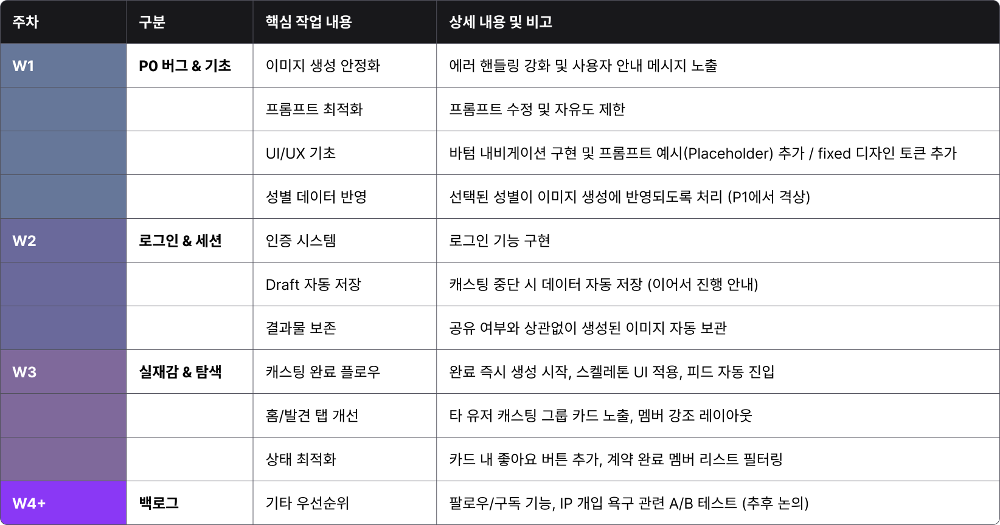

# Phase 2 기획 발표 - 도입 & 3주 계획

**발표자**: 전제이
**발표일**: 2026-02-25
**슬라이드**: Phase2-00 (표지), Phase2-01 (계획)

---

네 일단 페이지 2 방향성에 대해 좀 논의를 해봤고요. 어제 주차별로 나온 계획은 다음과 같습니다. 근데 아직 좀 큰 틀에서만 나왔고 롤별로 구체적인 계획은 안 나온 상태인 것 같아요.

그래서 일단 로그인 계정 부분에 대해서는 이거는 일단 패스를 하겠습니다. 제가 좀 이거는 고민을 한 흔적이고요. 이제 페이즈 2의 큰 방향은 실제감 강화가 될 것 같아요.

## 3주 스프린트 계획

**3주 스프린트 계획**: W1(PO 버그&기초), W2(로그인&세션), W3(실제감&탐색), W4+(백로그)

슬라이드의 주차별 계획 표를 보시면:

- **W1**: PO 버그 & 기초
- **W2**: 로그인 & 세션
- **W3**: 실제감 & 탈색
- **W4+**: 백로그

근데 아직 좀 큰 틀에서만 나왔고 롤별로 구체적인 계획은 안 나온 상태인 것 같습니다.

---

**다음 섹션**: 문제 정의 - 왜 실제감을 강화해야 하는가
