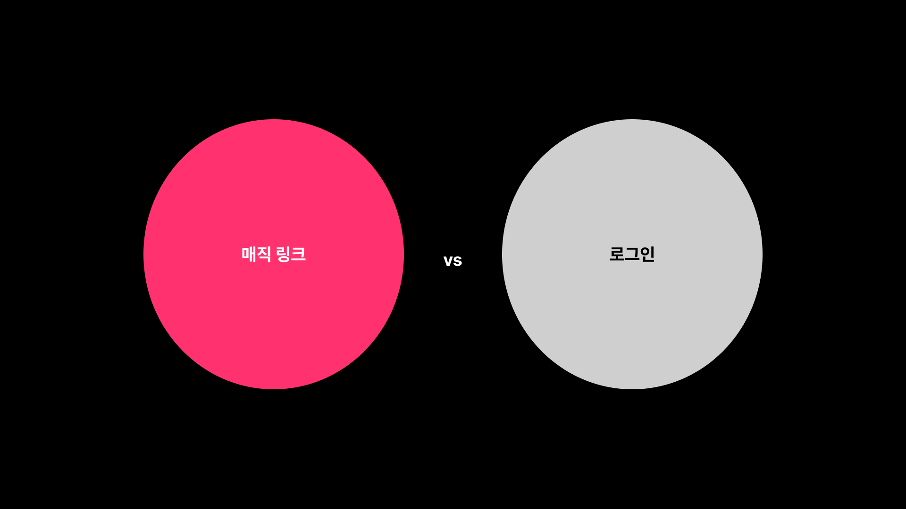
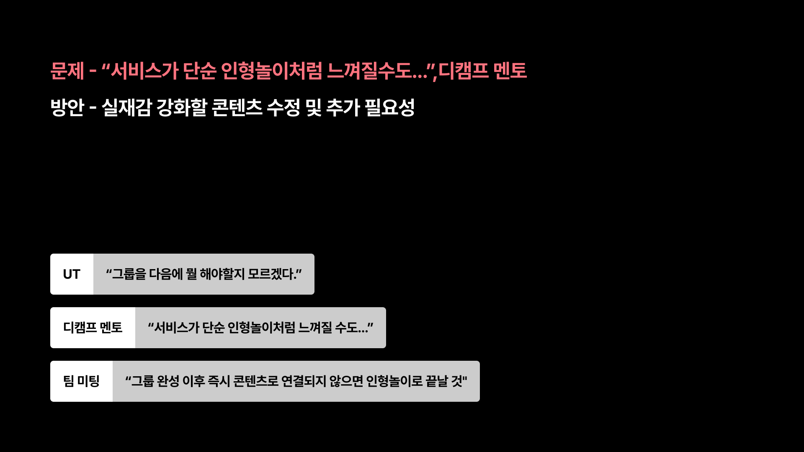

# Phase 2 기획 발표 - 문제 정의 & 방향성

**발표자**: 전제이
**발표일**: 2026-02-25
**슬라이드**: Phase2-02 (인증 방식 비교), Phase2-03 (문제 정의)

---

## 인증 방식 비교

**매직링크 vs 로그인**: 인증 방식 비교 (매직링크 vs 로그인)

---

## 실제감이 뭐냐면

디캠프 멘토님께서 저희 서비스를 사용해 보시고 단순 인형 놀이처럼 느껴질 수도 있다고 이제 코멘트를 주셨다고 합니다.

단순 인형놀이라는 것이 이 아이돌을 캐스팅하고 그냥 이미지로만 소비하거나 뭔가 이게 살아 있는 게 아니라 그냥 그냥 놀이 콘텐츠 가벼운 느낌의 그런 것 그런 느낌을 받으신 것 같아요.

그리고 ut에서도 좀 비슷한 의견이 나왔었어요. 그룹에서 다음 뭐 해야 될지 모르겠다.

## 팀 내 논의 결과

그다음에 뭐 저 이 팀 미팅에서는 그룹 완성 이후 즉시 콘텐츠로 연결되지 않으면 이 디캠프 멘토님과 비슷한 감정을 느낄 수 있을 감상을 하게 될 것 같다 이제 이런 의견이 나왔고요.

그래서 방안으로 실제감을 강화할 콘텐츠를 콘텐츠를 추가하거나 지금 있는 콘텐츠를 수정할 필요성이 있다고 생각을 했습니다.

**문제 정의**: 디캠프 멘토 피드백 "단순 인형놀이처럼 느껴질 수 있다" + 팀 미팅 의견 "그룹 완성 후 즉시 콘텐츠로 연결되지 않으면 감상을 하게 될 것" + UT 피드백

---

**다음 섹션**: 실제감 강화 기능 구체적 제안
