# Phase 2 기획 발표 - AI 아이돌 가이드 개선

**발표자**: 전제이
**발표일**: 2026-02-25
**슬라이드**: Phase2-05 (AI 아이돌 가이드, 12장)

---

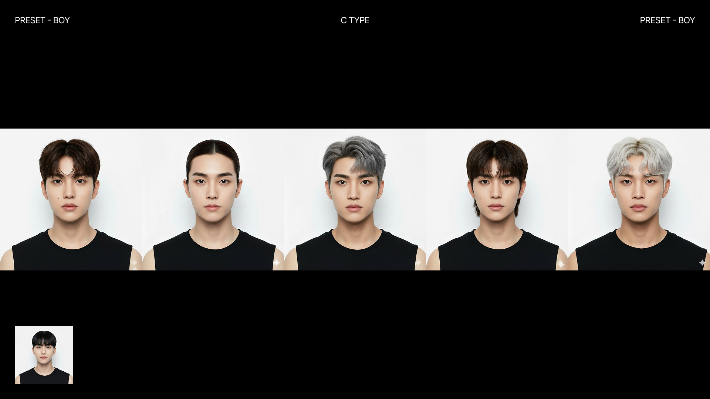

## 새로운 AI 아이돌 가이드

그다음 이제 이거는 제가 어제 열심히 진행을 한 건데 저희 AI 아이돌 가이드를 좀 다시 세워봤습니다.

일단 저희가 지금 프리셋 아이돌의 시각적 일관성이 조금 떨어진다고 생각했고 인종 다양성이 좀 필요하다고 생각을 했어요.

그래서 프롬포트를 좀 수정해서 이거를 해결할 수 있지 않을까라고 생각해서 수정을 해봤습니다.

그래서 저는 크게 4가지 타입으로 제작을 했고요. a 타입 a 타입 b 타입 c 타입 b타입 이렇게 해서 포즈나 이제 스튜디오의 빛 방향이나 이런 걸 생각해서 다양하게 한번 뽑았어 뽄아봤습니다.

이제 왼쪽 하단에 있는 거는 각 타입별 마스터 이미지고요. 네 생각보다 다양하게 잘 나와서 이걸로 진행을 해보면 어떨까 생각을 하고 있습니다. 되게 눈으로 딱 봤을 때 좀 깔끔한 것 같아서요.

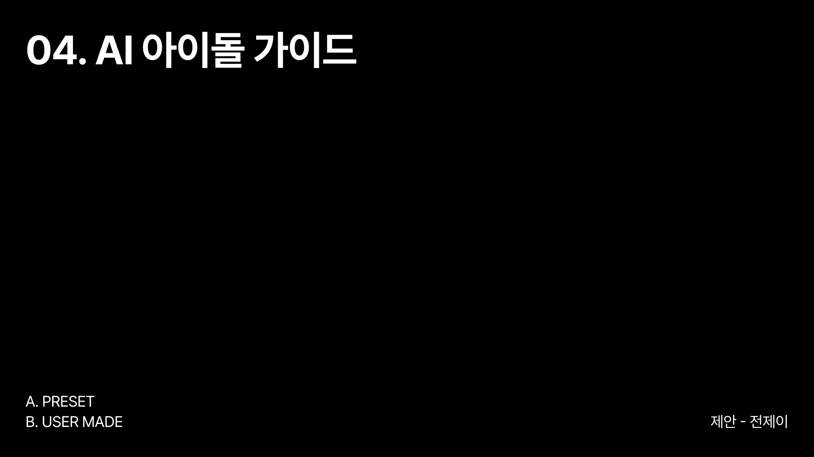

**섹션 제목**: "04. AI 아이돌 가이드" - PRESET vs USER MADE 선택지

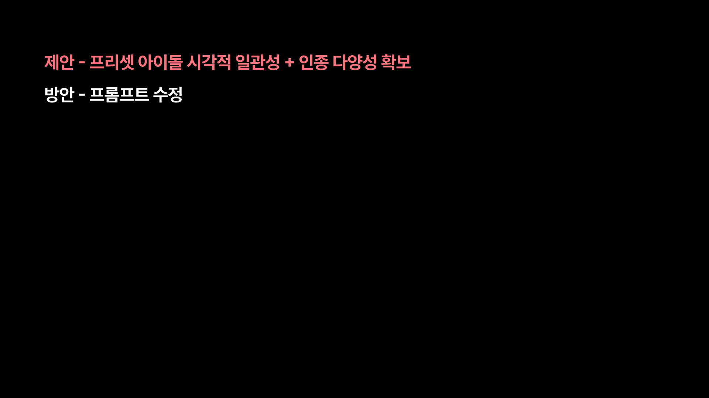

**제안 및 방안**: 프리셋 아이돌의 시각적 일관성 개선과 인증 다양성 확보
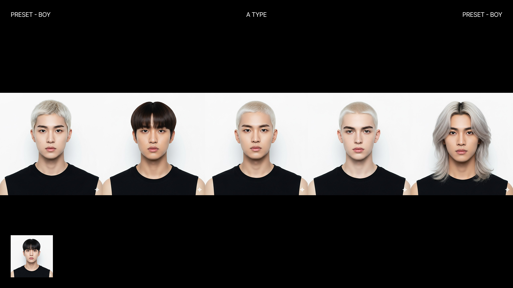

**PRESET - BOY - A TYPE**: 5가지 얼굴 타입 (쿨, 청순, 강렬 등)

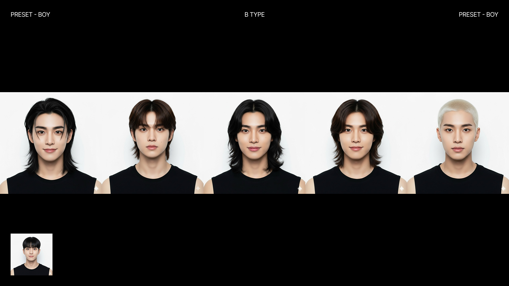

**PRESET - BOY - B TYPE**: 롱헤어 등 다양한 스타일

## 프리셋 아이돌 개선 결과

저 근데 저 근데 책 들어와 있죠 오케이 그래서 이렇게 적용하게 되면은 이런 느낌이 될 것 같습니다. 여기 외국인도 한 명 껴 있습니다.

## User-Made 아이돌 생성 시 고민사항

그다음에 이거 관련해서 또 이제 실존 인물을 연상하게 하는 부분도 있었고 유저 이제 유저가 새로운 멤버를 만들 때의 부분으로 넘어가겠습니다.

이 실존 인물 연상은 무시해 주세요. 서비스 의도와 다른 이미지가 생성되는 경우가 많잖아요. 저희가 지금 제가 이걸 어떻게 하면 좋을까 생각을 하다가 이제 프롬프트를 수정하고 자유도를 좀 제한하는 방향이 어떨까라고 생각을 해봤습니다.

ut에서도 약간 한글로 쓰면 반영이 안 되는 것 같아요. 그러니까 내가 의도한 느낌으로 아이돌이 안 나온다는 거겠죠. 그래서 좀 고민을 해보게 됐습니다.

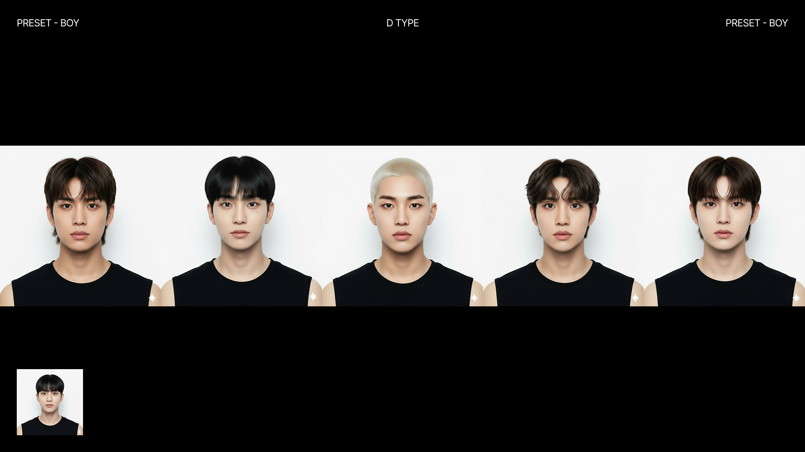

**PRESET - BOY - C TYPE**: 중성적 느낌의 다양한 타입

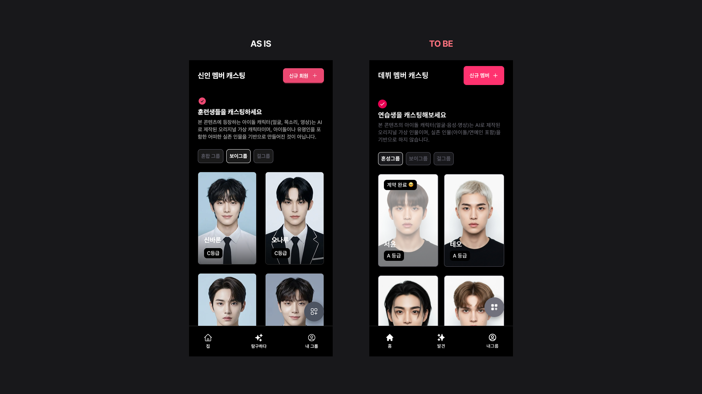

**PRESET - BOY - D TYPE**: 부드러운 분위기의 캐릭터들
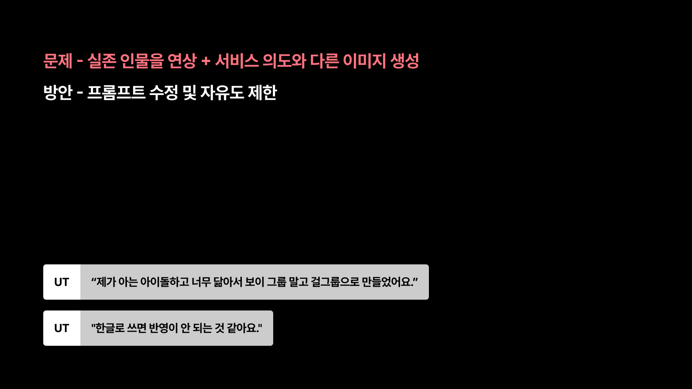

**프로필 개선 AS IS/TO BE**: 신입 멤버 vs 데뷔 멤버 - 더 많은 정보 제공

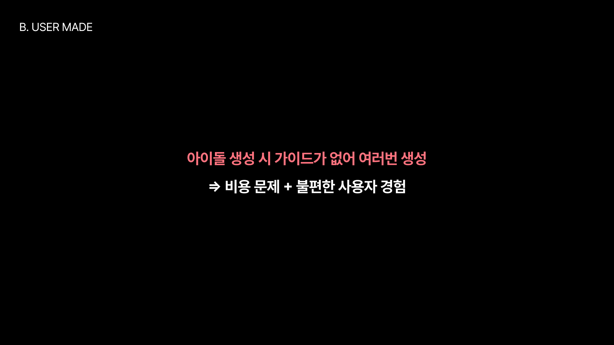

**사용자 인상 연상 및 프롬프트 개선**: 사용자가 아이돌들과 다르지 않음을 인식하고 가이드 강화

그래서 제가 생각한 이제 프롬프트 수정 방식은 이제 고정 레퍼런스 이미지 하나랑 이 레퍼런스 이미지를 따라라 라는 고정 블록 하나랑 그다음에 유저가 선택할 수 있는 인종 분위기 인상 헤어 이런 가벼운 블록을 넣고 그다음에 다양성을 추가해라 약간 이렇게 해서 이 구조를 이렇게 짜봤고요.

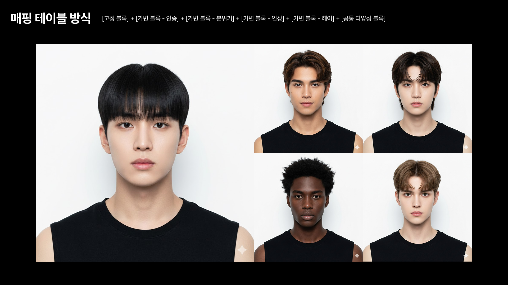

**B. USER MADE**: 가이드 없어 여러운 사용자 경험 → 비용 문제와 불편한 사용자 경험 해소

## 프롬프트 구조화 결과

이렇게 해서 이제 이미지를 생성해 봤을 때 이렇게 조금 일관되면서도 다양한 이미지가 나오더라고요. 그래서 이렇게 해보면 어떨까 생각을 했습니다.

그래서 UI가 어떻게 바뀔 것이냐 했을 때 이제 프롬프트를 작성하는 것에서 프롬프트를 선택하는 방향으로 가면 어떨까 생각을 했습니다. 그러면 굉장히 좀 일관성이 높아지지 않을까 뭐야 그 프롬프트를 한국어에서 영어로 변환하는 그런 것도 좀 생각을 하고 찾아봤는데 한국 영어로 번역을 했을 때 영어가 한국어를 정확하게 반영하지 않을 수 있다고 해서 좀 적인 이제 해결 방법은 아니라고 생각을 해서 좀 제외를 했고요.

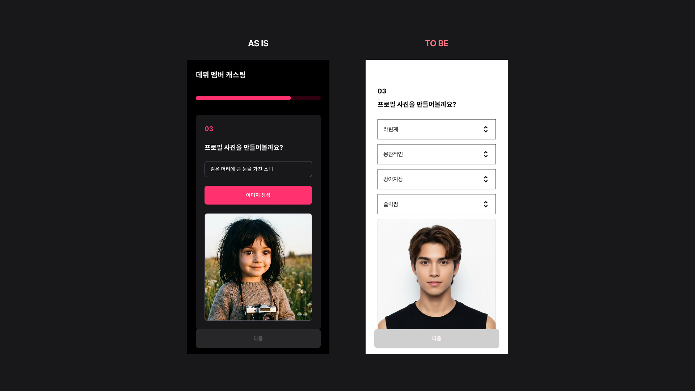

**매핑 테이블 방식**: 고정형(콘셉트), 기반 설정(분류), 기반 분류(스타일) 등 다양한 조합 방식

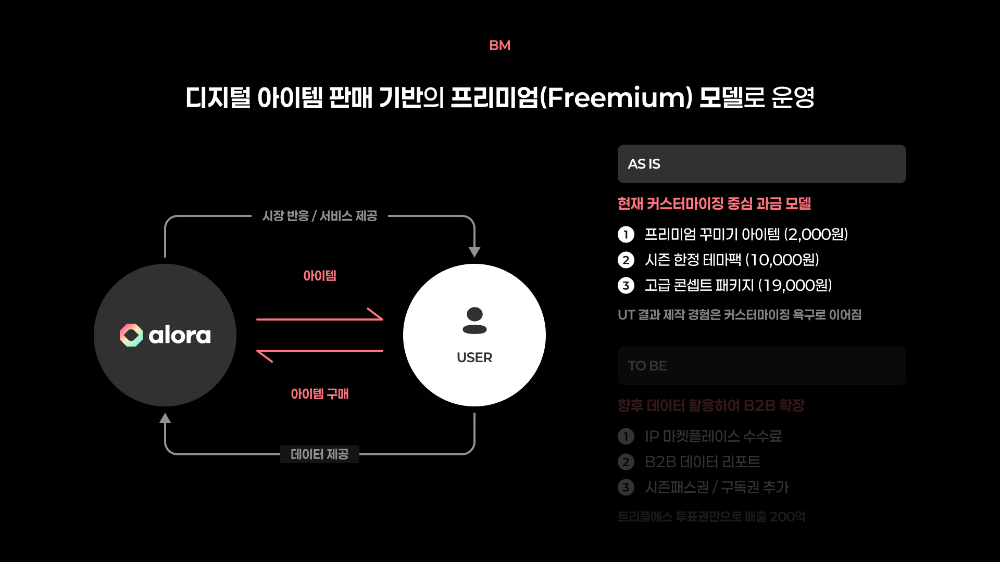

**데뷔 멤버 캐스팅 개선**: AS IS/TO BE - 이미지 선택 옵션 다양화 (라딘제, 응집적인, 김아지상, 술취린)

## 커스터마이징 과금 모델 대비

그리고 또 이렇게 한 이유 중에 하나도 하나는 저희가 지금 bm이 커스터마이징 중심 과금 모델인데 커스터마이징을 할 수 있는 요소가 없더라고요. 그래서 이런 식으로 좀 이렇게 항목을 나눠서 제공을 하면은 이후에 bm에 맞춰서 서비스를 설계할 때 더 괜찮은 방향으로 가지 않을까라고 생각을 해서 향후 그런 것도 좀 생각을 해봤습니다.

**BM - 프리미엄 모델**: 디지털 아이템 판매 기반 (Alora와 User 간 아이템 거래 및 B2B 확장)

---

**다음 섹션**: 확장 영역 (향후 검토)
