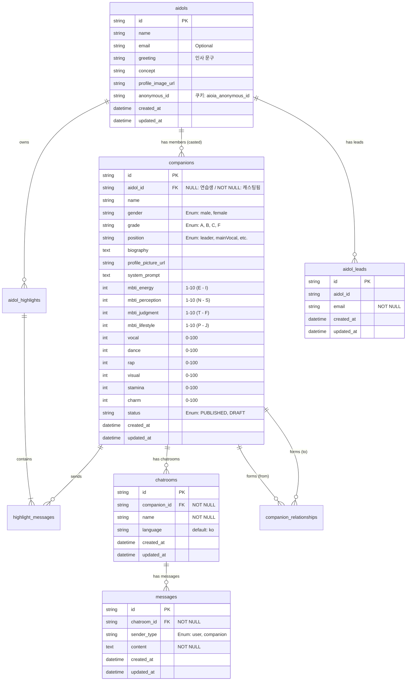

# AIdol ERD

- 원본: [Notion](https://www.notion.so/2f046f96550480168a53f9f6a9f79d0b)

---

## Entity Relationship Diagram

---

## 테이블 요약

| 테이블                    | 설명              | Sprint |
| ------------------------- | ----------------- | ------ |
| `aidols`                  | 아이돌 그룹       | 1      |
| `companions`              | 그룹 멤버         | 1      |
| `aidol_leads`             | Viewer 정보       | 1      |
| `idol_highlights`         | 아이돌 하이라이트 | 2      |
| `highlight_messages`      | 하이라이트 메세지 | 2      |
| `companion_relationships` | 멤버 관계 설정    | 2      |
| `chatrooms`               | 채팅방            | 3      |
| `messages`                | 메시지            | 3      |

---

## 관계

| 관계                   | 설명                       |
| ---------------------- | -------------------------- |
| aidols → companions    | 1:N (그룹당 여러 멤버)     |
| companions → chatrooms | 1:N (멤버당 여러 채팅방)   |
| chatrooms → messages   | 1:N (채팅방당 여러 메시지) |

---

## 필드 상세

### aidols

| 필드              | 타입    | 제약 | 설명                                          |
| ----------------- | ------- | ---- | --------------------------------------------- |
| id                | UUID    | PK   | 자동 생성                                     |
| name              | str     | -    | 그룹명                                        |
| email             | str     | -    | Creator 이메일                                |
| greeting          | str     | -    | 인사 문구                                     |
| concept           | str     | -    | 그룹 컨셉                                     |
| profile_image_url | str     | -    | 엠블럼 이미지                                 |
| anonymous_id      | str(36) | -    | 익명 사용자 식별자 (쿠키: aioia_anonymous_id) |

### aidol_leads

| 필드     | 타입 | 제약 | 설명          |
| -------- | ---- | ---- | ------------- |
| id       | UUID | PK   | 자동 생성     |
| aidol_id | UUID | -    | 그룹 ID       |
| email    | str  | -    | Viewer 이메일 |

### companions

| 필드                | 타입 | 제약   | 설명                |
| ------------------- | ---- | ------ | ------------------- |
| id                  | UUID | PK     | 자동 생성           |
| aidol_id            | UUID | FK, IX | aidols 참조         |
| name                | str  |        | 멤버 이름           |
| gender              | str  |        | 성별                |
| grade               | str  |        | 등급                |
| biography           | text |        | 성격 설명           |
| profile_picture_url | str  |        | 프로필 이미지       |
| system_prompt       | text |        | LLM 시스템 프롬프트 |
| mbti_energy         | int  | 1-10   | E ↔ I               |
| mbti_perception     | int  | 1-10   | S ↔ N               |
| mbti_judgment       | int  | 1-10   | T ↔ F               |
| mbti_lifestyle      | int  | 1-10   | J ↔ P               |
| vocal               | int  | 0-100  | 가창력              |
| dance               | int  | 0-100  | 댄스 실력           |
| rap                 | int  | 0-100  | 랩 실력             |
| visual              | int  | 0-100  | 비주얼              |
| stamina             | int  | 0-100  | 체력                |
| charm               | int  | 0-100  | 매력도              |
| position            | str  |        | 포지션              |

### chatrooms (Sprint 2)

| 필드         | 타입 | 제약             | 설명              |
| ------------ | ---- | ---------------- | ----------------- |
| id           | UUID | PK               | 자동 생성         |
| companion_id | UUID | FK, IX, NOT NULL | companions 참조   |
| name         | str  | NOT NULL         | 채팅방 이름       |
| language     | str  | NOT NULL         | 언어 (기본: "ko") |

### messages (Sprint 2)

| 필드        | 타입 | 제약             | 설명                  |
| ----------- | ---- | ---------------- | --------------------- |
| id          | UUID | PK               | 자동 생성             |
| chatroom_id | UUID | FK, IX, NOT NULL | chatrooms 참조        |
| sender_type | str  | NOT NULL         | "user" \| "companion" |
| content     | text | NOT NULL         | 메시지 내용           |
