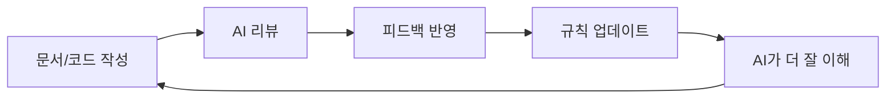

# AIoIA

## Day 1부터 AI와 함께 자라는 조직

<br>

**카카오벤처스 2월 오피스아워**

<style>
h1 {
  color: #E70051 !important;
}
</style>

---

# 우리는 AIoIA

<br>

<v-clicks>

**K-pop AI 아이돌** 생성 + 채팅 + 육성 플랫폼

**9명의 소규모 팀**, 그리고 10번째 팀원은 AI

**Day 1부터** 모든 프로세스에 AI 내재화

**AI 안 쓰는 과정이 없다**

</v-clicks>

<style>
h1 {
  color: #E70051 !important;
}
</style>

---

# AI-Native 조직이란?

<br>

> "Day 1부터 AI와 함께 자라지 않은 회사는 살아남기 어렵다"

<br>

<v-clicks>

회사의 **암묵지/형식지**를 AI에 학습

시간이 지날수록 **AI가 우리 방식을 더 잘 이해**

사람이 늘지 않아도 **생산성이 복리로 증가**

</v-clicks>

<style>
h1 {
  color: #E70051 !important;
}
blockquote {
  border-left-color: #E70051 !important;
  font-style: italic;
}
</style>

---

# 회사 전체가 GitHub에

<br>

| 레포 | 용도 | AI 설정 |
|------|------|--------|
| `/docs` | **Company Handbook** (비공개) | CLAUDE.md, .gemini, .github |
| `/aidol` | **메인 코드** | CLAUDE.md + 규칙 파일들 |
| `/aidol-docs` | **제품/IR 문서** | copilot-instructions, .gemini |

<br>

> 정관, 지분계약서, 재무, IR 자료, PRD, 코드까지 **모든 것이 버전 관리**

<style>
h1 {
  color: #E70051 !important;
}
</style>

---

# Company Handbook 구조

```
algorima/docs/
├── 01_problem-insight/    # 문제 정의, 시장 리서치
├── 02_solution-product/   # PRD, 디자인, 프로토타입
├── 03_go-to-market/       # 마케팅, 캠페인
├── 04_evidence-metrics/   # OKR/KPI, 대시보드
├── 05_customers-sales/    # 고객 인터뷰, 세일즈
├── 06_ir-application/     # IR Deck, YC 지원서
└── 07_finance-ops/        # 재무, 법률, 정관 ← 여기까지!
```

**파일명 규칙**: `YYYYMMDD__주제__상태__vX.Y__소유자.md`

→ AI가 파일명만 보고 맥락을 이해

<style>
h1 {
  color: #E70051 !important;
}
</style>

---

# AI 설정 파일들

<div class="grid grid-cols-2 gap-4">
<div>

### CLAUDE.md (메인 코드)
```markdown
# AIdol 개발 가이드
## 코드 품질
- DRY: 중복 금지
- Guard Clause: 전제조건 검사
- 5 Whys: 근본 원인 파악
## 보안
- LLM Prompt Injection 방지
## 테스트
- TDD: Red → Green → Refactor
```

</div>
<div>

### 규칙 파일 예시 (Claude Code + Cursor 공용)
```
arrow-function.mdc
coding-practices.mdc
component-architecture.mdc
error-handling.mdc
frontend.mdc
pull-request.mdc
tests.mdc
...
```

→ AI가 우리 코드 스타일을 학습

</div>
</div>

<style>
h1 {
  color: #E70051 !important;
}
</style>

---

# AI가 YC 파트너처럼 리뷰

<div class="grid grid-cols-2 gap-4">
<div>

### copilot-instructions.md + .gemini/styleguide.md

```markdown
당신은 YC 파트너입니다.
YC 지원서를 검토할 때는
아래 가이드라인을 참고하세요.

- YC가 궁극적으로 알고 싶어 하는 것:
  이 회사가 10억 달러 규모가
  될 수 있는가?
- 간결하게 작성하세요.
- 정직하세요.
```

**Gemini + Copilot 모두 동일 지침 (443줄)**

</div>
<div>

### ir-master/ 매핑 시스템

```
00-company-overview.md
01-problem.md
02-solution.md
...
08-ask.md
└── mappings/
    ├── yc-mapping.md
    └── 초창패-mapping.md
```

→ 하나의 원본 → 여러 지원서 생성

</div>
</div>

<style>
h1 {
  color: #E70051 !important;
}
</style>

---

# 실제 Gemini 리뷰: YC 파트너 관점

PR을 올리면, Gemini가 자동으로 YC 파트너 시각에서 리뷰합니다.

<br>

### PR #8 - 비즈니스 전략 문서

> "비전과 핵심 정체성을 명확히 정의한 점이 좋습니다. 투자자에게 더욱 효과적으로 전달하기 위해, 'AI 시대의 유튜브/틱톡'이라는 목표가 어느 정도의 시장 규모를 가지는지에 대한 분석(TAM/SAM/SOM)을 추가하는 것을 제안합니다. **YC 가이드라인(257-261행)에서도 TAM 추정치가 사용된다고 강조하고 있습니다.**"
>
> — gemini-code-assist[bot]

<br>

→ 피드백 반영하여 TAM/SAM/SOM 분석 추가 커밋 완료

<style>
h1 {
  color: #E70051 !important;
}
</style>

---

# Gemini 리뷰가 만든 변화

**17개 연속 PR** 모두 Gemini가 자동 리뷰 (PR #8 ~ #24)

<br>

| PR | 내용 | Gemini 피드백 | 결과 |
|----|------|-------------|------|
| #7 | 플랫폼 전략 PRD | 전환율 데이터 불일치, API 가격 명확화 | 6건 수정 반영 |
| #8 | 비즈니스 전략 | TAM/SAM/SOM 추가 제안 | 시장 분석 보강 |
| #9 | 파일명 리팩토링 | "YC 가이드의 '간결함' 원칙을 잘 적용" | 구조 개선 확인 |
| #14 | IR 덱 수정 | "YC가 중시하는 성장 지표, 창업자-시장 적합성 반영" | IR 품질 향상 |
| #20 | 오렌지플래닛 지원서 | "YC 원칙(창업 동기, 문제 정의, 팀 역량) 잘 적용" | 지원서 완성도 |

<br>

→ AI가 **심사역처럼** 문서를 검증하고, 팀이 피드백을 반영

<style>
h1 {
  color: #E70051 !important;
}
</style>

---

# Claude Code + MCP

<div class="grid grid-cols-2 gap-4">
<div>

## MCP로 모든 도구 연결

**노션 DB**
- 회계/재무 데이터 직접 접근
- 재무 분석, 리포트 자동 생성

**Figma**
- 디자인 파일 MCP로 읽기
- 디자인 → 코드 브릿지

**Asana**
- 할 일/스프린트 관리
- Claude가 업무 정리, 일정 조율

</div>
<div>

## 캡쳐 자리

*Claude가 MCP로 노션/Figma/Asana 접근하는 화면*

</div>
</div>

<style>
h1 {
  color: #E70051 !important;
}
</style>

---

# Slack + Sentry + Claude

<div class="grid grid-cols-2 gap-4">
<div>

## 실시간 AI 협업

**Sentry 오류 발생**
```
TypeError in /api/chat
→ Slack 알림
→ @Claude 분석해줘
→ 즉시 원인 분석 + 해결책 제안
```

**팀원 간 논의**
- 기술 토론에 Claude 멘션
- 의사결정 근거 즉시 확인
- 컨텍스트 스위칭 최소화

</div>
<div>

## 캡쳐 자리

*Slack에서 Claude 멘션하는 화면*

</div>
</div>

<style>
h1 {
  color: #E70051 !important;
}
</style>

---

# 코드 리뷰: AI 통과 필수

<div class="grid grid-cols-2 gap-4">
<div>

## 3중 AI 리뷰 체계

**1. Claude Code + 규칙 파일**
- 코딩 중 실시간 피드백
- CLAUDE.md + 규칙 파일로 스타일 일관성

**2. GitHub Copilot**
- PR 올리면 자동 리뷰
- 한국어로 응답 (설정됨)

**3. Gemini Code Assist**
- 다른 관점에서 이중 체크

→ **AI 리뷰 통과 후** 사람 리뷰

</div>
<div>

## 캡쳐 자리

*PR에서 AI가 한국어로 리뷰하는 화면*

</div>
</div>

<style>
h1 {
  color: #E70051 !important;
}
</style>

---

# PostHog + AI 분석

<div class="grid grid-cols-2 gap-4">
<div>

## Session Replay → AI 분석

**PostHog 녹화**
- 사용자 행동 세션 리플레이
- MP4 + 이벤트 로그 저장

**AI 분석**
- 녹화 영상을 AI에게 제공
- "이 사용자가 어디서 막혔는지 분석해줘"
- 이탈 지점, UX 개선점 자동 도출

**데이터 기반 의사결정**
- 감이 아닌 AI 분석 기반 UX 개선

</div>
<div>

## 캡쳐 자리

*PostHog 세션 리플레이 또는 AI 분석 결과*

</div>
</div>

<style>
h1 {
  color: #E70051 !important;
}
</style>

---

# Playwright + AI 테스트

<div class="grid grid-cols-2 gap-4">
<div>

## AI가 사용자처럼 테스트

**Playwright E2E 테스트**
- 자동화된 브라우저 테스트
- CI/CD 파이프라인 연동

**AI 테스트 시나리오**
- AI가 "사용자처럼" 행동
- 예상치 못한 엣지 케이스 발견
- 자연어로 버그 리포트 생성

**TDD 필수 (CLAUDE.md)**
- Red → Green → Refactor
- 테스트 삭제 = 품질 포기

</div>
<div>

## 캡쳐 자리

*Playwright 테스트 또는 CI/CD 결과*

</div>
</div>

<style>
h1 {
  color: #E70051 !important;
}
</style>

---

# AI가 학습하는 방식

<br>



<br>

<v-clicks>

**CLAUDE.md, 규칙 파일** → 코드 스타일 학습

**copilot-instructions, .gemini/styleguide** → 문서 검토 + YC 파트너 기준 학습

**파일명 규칙** → 프로젝트 맥락 이해

</v-clicks>

<style>
h1 {
  color: #E70051 !important;
}
</style>

---

# AI-Native의 결과

<br>

<v-clicks>

**문서 작성** → AI가 초안 + YC 파트너 기준 리뷰

**코드 리뷰** → 3중 AI 체크 후 사람 리뷰

**버그 대응** → Sentry + Slack + Claude 즉시 분석

**지원서** → ir-master 매핑으로 복붙 최소화

**지식 축적** → 규칙 파일이 계속 진화

</v-clicks>

<br>

> *"사람이 늘지 않아도 AI가 함께 자란다"*

<style>
h1 {
  color: #E70051 !important;
}
blockquote {
  border-left-color: #E70051 !important;
}
</style>

---

# 실제 사례: 10분 vs 2시간

**어느 오후, 대표가 AI에게 요청한 작업들**

| 작업 | AI | 수동 (추정) |
|------|-----|------------|
| iMessage 채널 연결 (설치+설정+테스트) | 5분 | 35분 |
| 문서 레포 구조 개편 + PR (폴더 6개, README 7개) | 3분 | 75분 |
| Slack 공지 메시지 작성 + 전송 | 1분 | 10분 |
| 개발 채널 멤버 파악 + 멘션 메시지 | 1분 | 10분 |
| **합계** | **10분** | **130분** |

<br>

<v-click>

### 생산성 향상: **13배**

*"대표가 2시간 걸릴 일을 AI와 함께 10분에 끝냈습니다"*

</v-click>

<style>
h1 {
  color: #E70051 !important;
}
</style>

---
layout: center
class: text-center
---

# Thank You

<br>

## AI와 함께 자라는 조직, AIoIA

<br>

sylee@aioia.ai

github.com/algorima

aioia.ai

<style>
h1 {
  color: #E70051 !important;
}
</style>
