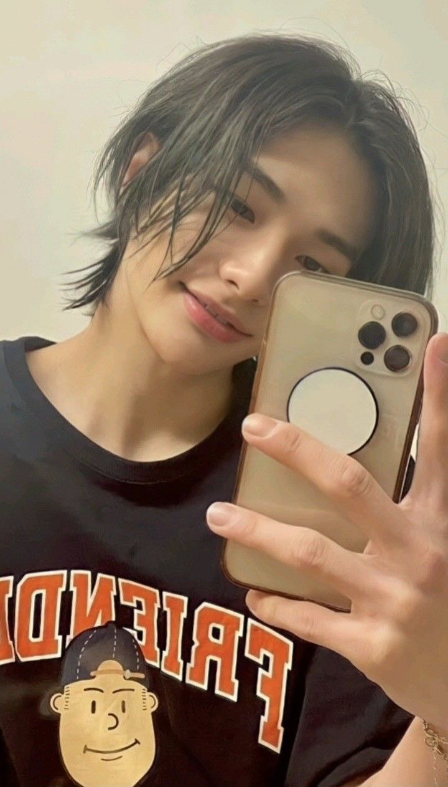
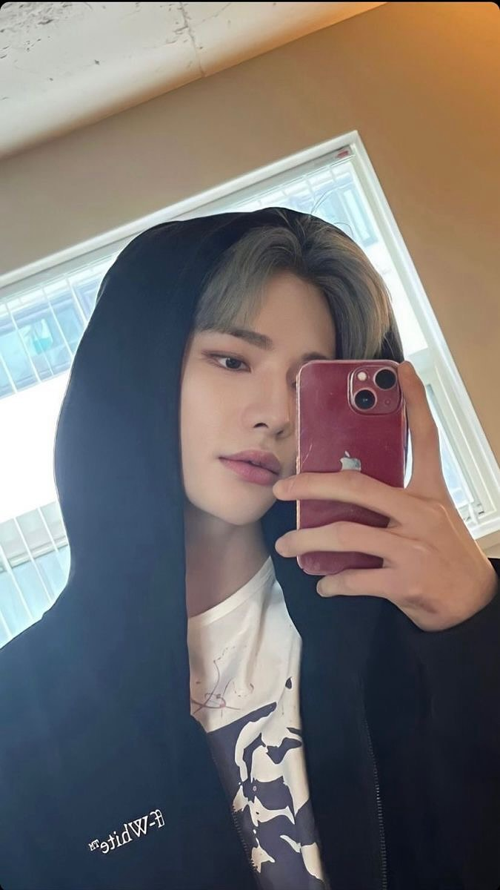
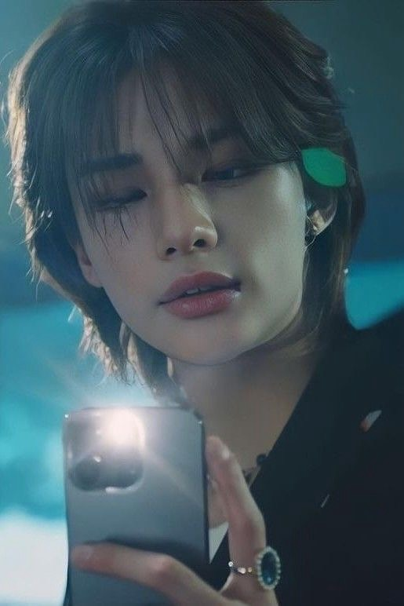
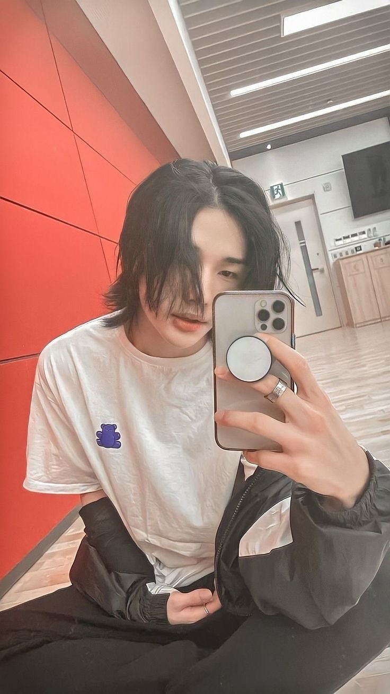
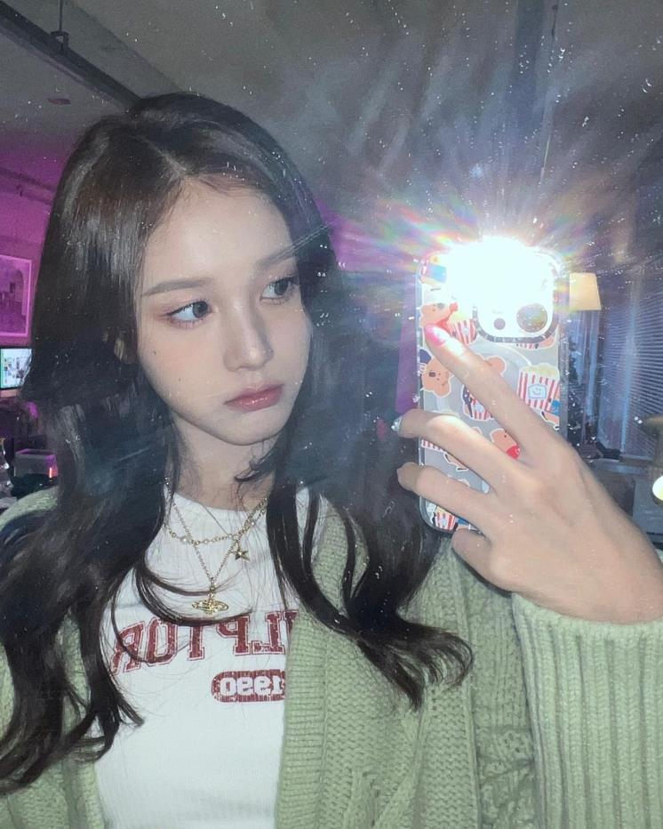
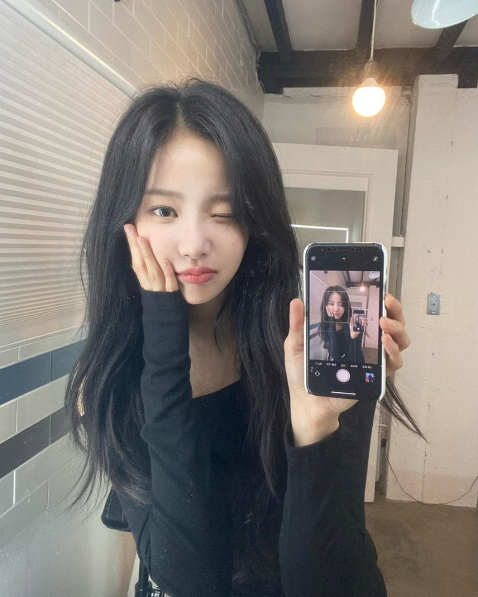
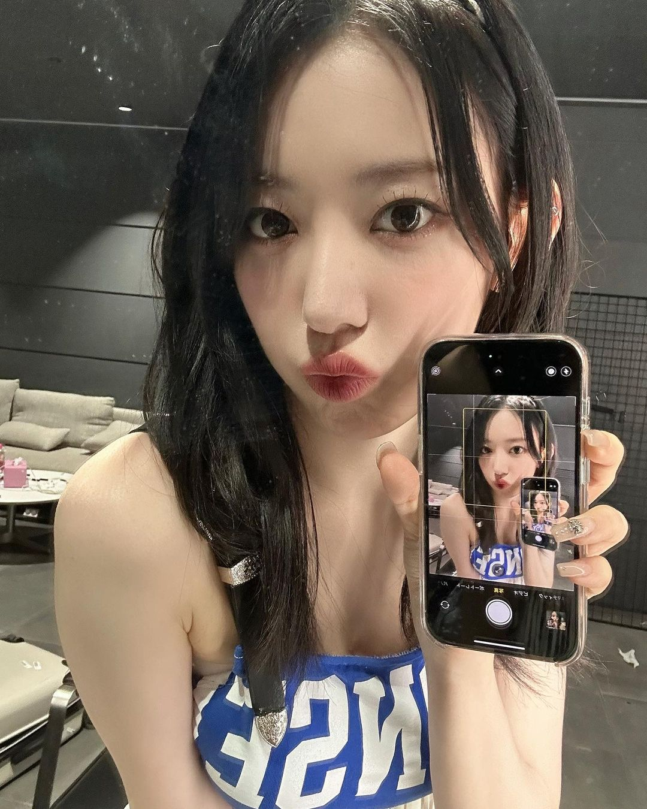
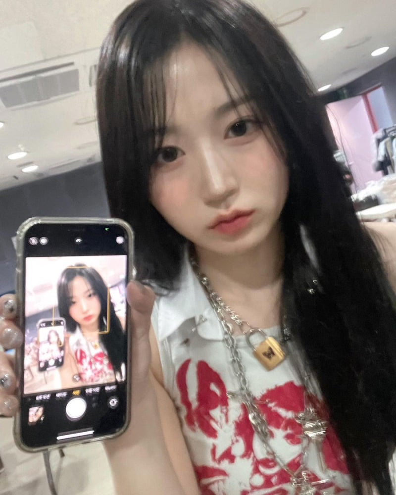

# Idol Mirror Selfie 콘텐츠 생성 기획안

## 1. 콘텐츠 목적

피드 탭 진입 시 가장 먼저 노출되는 기본 콘텐츠로, 유저가 서비스를 열었을 때 AI 아이돌이 실제로 SNS를 운영하는 것 같은 느낌을 주는 것이 목적이다.
아이돌이 연습 중 잠깐 쉬는 시간에 찍은 셀카처럼 보이게 하여 캐릭터와 유저 사이의 첫 감정 연결을 만든다.
또한 피드 탭이 비어 보이지 않도록 기본 콘텐츠 역할을 한다.

**핵심 경험**
유저가 피드를 열었을 때 "아이돌이 방금 연습하다가 셀카 찍어서 올린 것 같다"는 느낌을 받는 것이 목표이다.

---

## 2. 콘텐츠 컨셉

연습실 거울 셀카 콘셉트.
연습 중 쉬는 시간에 연습실 거울 앞에서 자연스럽게 찍은 셀카 느낌.

**분위기**
과하게 연출된 사진이 아니라 가볍게 찍은 셀카 느낌.

**레퍼런스**

| 거울셀카_1 | 거울셀카_2 | 거울셀카_3 | 거울셀카_4 |
|---|---|---|---|
|  |  |  |  |
| 폰 화면 보여주기, 입술 포즈 | 폰 화면 보여주기, 무표정 | 한 손 볼에 대기, 윙크 | 후드 착용, 폰으로 얼굴 일부 가리기 |

| 거울셀카_5 | 거울셀카_6 | 거울셀카_7 | 거울셀카_8 |
|---|---|---|---|
|  |  |  |  |
| 아래를 내려다보는 무드샷 | 연습실 바닥에 앉아서, 흰 박스티 | 검은 박스티, 클로즈업, 약간의 미소 | 플래시 반사, 시선 분산 |

---

## 3. 출력 이미지 스펙

- 이미지 타입: photorealistic selfie
- 해상도: 1024 x 1280
- 비율: 4:5
- 구도: mirror selfie, upper body
- 카메라: iPhone 16 black color

---

## 4. 고정 요소 (Character Consistency)

다음 요소는 항상 유지되어야 한다.

reference image를 사용하여 얼굴 동일성을 유지한다.

**반드시 유지해야 하는 요소**
- 얼굴
- 얼굴 특징
- 헤어스타일

**추가 유지 요소**
- 아이돌의 전체 분위기
- 연령대
- 피부톤

---

## 5. 환경 설정

- 배경: dance practice room, large mirror wall, wood floor
- 소품: dance studio mirror
- 조명: natural indoor lighting

목표는 실제 연습실에서 스마트폰으로 찍은 셀카 같은 느낌이다.

---

## 6. 랜덤 요소 (콘텐츠 다양성)

**셀카 구도**
- slightly angled selfie
- mirror selfie
- casual selfie
- off-center selfie

**표정**
- small smile
- neutral expression
- soft smile
- slightly playful

**포즈**
- holding phone
- peace sign
- hand touching hair
- relaxed pose

**카메라 높이**
- eye level
- slightly above eye level
- slightly lower angle

---

## 7. 네거티브 프롬프트

```
blurry, low resolution, illustration, cartoon, anime, cgi, distorted face, different hairstyle, different person, extra fingers, bad hands
```

---

## 8. 콘텐츠 생성 규칙

피드용 이미지이므로 다음 규칙을 적용한다.

- 캐릭터 동일성 유지
- 셀카 스타일만 랜덤으로 변화
- **멤버 한 명당 1장 생성**

**예시**
- 레온 셀카 1종
- 주아 셀카 1종
- 케인 셀카 1종
